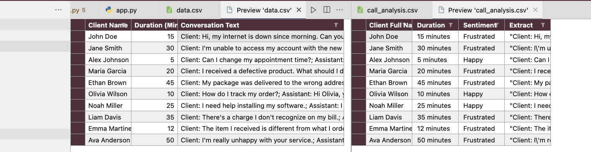

# Call Log Analysis AI Tool

## Overview

The Call Log Analysis AI Tool is designed to automatically process and analyze call logs, providing valuable insights into the sentiment and other data-related information from conversations. This powerful tool utilizes advanced AI algorithms to interpret the tone, mood, and overall sentiment of the discussions, turning raw call log data into actionable insights.


 ## Usage
 ```bash
 python3 -m venv venv
 source venv/bin/activate
 python3 install -r requirements.txt
 ./run.bat
 ```
 
 [CSV Example Data](call_analysis.csv)

 

 ## Technologies
 - OpenAI, chatgpt
 - streamlit

## Features

- **Sentiment Analysis:** The AI evaluates the emotional tone of conversations, categorizing them into positive, negative, or neutral sentiments. This feature helps in understanding customer satisfaction and identifying areas for improvement.
  
- **Data Insights:** Apart from sentiment analysis, the tool also extracts key information from the call logs, such as call duration, the caller's intent, and frequent topics of discussion, providing a comprehensive overview of the communication patterns.

- **Customizable Reports:** Generate reports based on the analyzed data, tailored to specific requirements. These reports can include metrics such as sentiment trends, topic frequency, and caller behavior patterns.

- **Easy Integration:** Designed to seamlessly integrate with existing call logging systems, ensuring a smooth workflow without the need for significant changes to current processes.

## How It Works

1. **Data Input:** Upload your call logs in CSV format. Please refer to the provided templates (`call_analysis_downloaded.csv` and `data.csv`) for the expected data structure.

2. **Processing:** Once uploaded, the AI begins processing the data. It analyzes the text of the conversations for sentiment and extracts relevant information based on predefined criteria.

3. **Output:** The tool generates a detailed report highlighting the sentiment analysis results and other insights derived from the call logs. This report is downloadable and can be used for further analysis or presentation purposes.

## Getting Started

To use the Call Log Analysis AI Tool, follow these steps:

1. **Prepare Your Data:** Ensure your call logs are formatted correctly according to the provided CSV template files.
2. **Upload Call Logs:** Use the tool's interface to upload your CSV file(s).
3. **Analyze:** Initiate the analysis process. The tool will process the uploaded call logs and start generating insights.
4. **Review Results:** Once the analysis is complete, review the generated report to gain insights into the sentiment and other data information from your calls.

## Requirements

- Call logs must be in CSV format, following the structure of the provided templates.
- Ensure that the call logs do not contain any sensitive or personally identifiable information (PII) as per compliance with data protection regulations.

## Support

For any technical issues or questions regarding the Call Log Analysis AI Tool, please contact our support team. We are here to assist you with any queries or feedback you may have.

---

By leveraging the Call Log Analysis AI Tool, businesses and organizations can gain deeper insights into their customer interactions, helping to improve communication strategies, customer satisfaction, and overall service quality.
